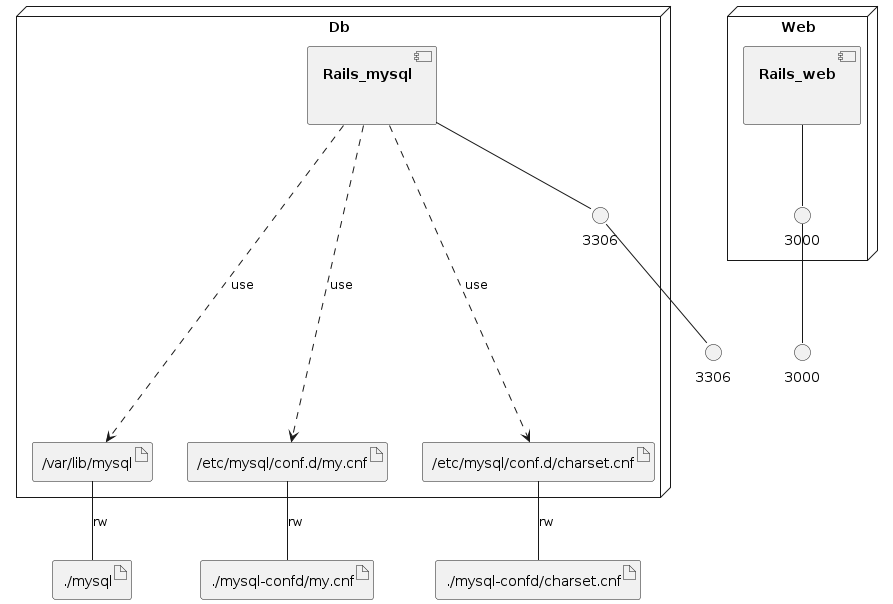

# docker-compose + Rails6 + MySQL8.0

## シェルによる手順
- `git clone`したときに置いている、Dockerfileとdocker-compose.ymlは消してOK

```shell
# e.g) /bin/bash /path/to/init.sh -p portfolio -r password
$ /bin/bash init.sh -p {project_name} -r {root_password}
```

## 手作業の手順
### 1. Dockerfileを元にしてdocker-compose.ymlで新たなコンテナイメージを作る
`docker-compose build` の実行
### 2. railsのWebサーバーコンテナとMySQLのDBサーバーコンテナを作る
1. `docker-compose up -d` の実行
2. `docker ps -a` の実行 で **STATUS**が**Up**になっていることを確認する
```sh
# 実行例
CONTAINER ID        IMAGE                        COMMAND                  CREATED             STATUS                       PORTS                                NAMES
91f279ffce2c        rails6_docker_template_web   "irb"                    2 minutes ago       Up 2 minutes                 0.0.0.0:3000->3000/tcp               rails_web
e90ff7416e08        rails6_docker_template_db    "docker-entrypoint.s…"   2 minutes ago       Up 2 minutes                 0.0.0.0:3306->3306/tcp, 33060/tcp    rails_mysql
```
#### 補足
`docker-compose logs`で、
`アプリサーバーコンテナ`（以下、**Webコンテナ**もしくは、**rails_web**）, 
DBサーバーコンテナ（以下、**DBコンテナ**もしくは、**rails_mysql**）が
正常に起動できているか等の確認ができる

### 3. Railsチュートリアルにしたがって、新しいプロジェクトを作る
ここでは、[Railsガイト/Railsをはじめよう](https://railsguides.jp/getting_started.html) にしたがって作るものとする。

以下は、**Railsガイト/Railsをはじめよう** の **3.1 Railsのインストール** にしたがった一例

#### Rubyのバージョン確認
```
root@2cd4872e0928:/usr/src# ruby -v

=> ruby 2.7.0p0 (2019-12-25 revision 647ee6f091) [x86_64-linux]
```
- 2020.2現在最新の公式Rubyイメージ（ruby:2.7.0）をDockerfileで定義している

#### （SQLiteのバージョン確認（MySQLを使用していくので今後インストールの必要もなし）)
```
root@2cd4872e0928:/usr/src# sqlite3 --version

=> bash: sqlite3: command not found
```
- DockerのRubyイメージを使っているため、当然インストールされていない
- 今後SQLiteを使うこともないので、インストールの必要はない

#### (Gemによるrailsのインストール)
```
root@2cd4872e0928:/usr/src# gem install rails

=> Successfully installed rails-6.0.2.1
   1 gem installed
```
- オプションなしだと、最新のRailsがインストールされる（2020.2現在、rails-6.0.2.1）
- バージョンを保つ目的でDockefile内で以下を定義している
- 事前にその定義の実行によって作られた環境であるため、改めて`gem install rails`をここで実行しなくてよい

```Docker
# Dockerfile
（抜粋）
RUN gem install rails --version="~>6.0.0"
```

##### 補足
- rails --versionでRailsのバージョンは調べられる
```
root@a19247e0a147:/usr/src# rails --version

=> Rails 6.0.2.1
```

#### プロジェクトの作成
1. rails newしてプロジェクトを作成する。
- ただし、docker-composeを使って、`rails new {project_name}`のコマンドを与える。
- また、初期状態からMySQLを使っていくので、オプションをつける

```
docker-compose exec web rails new {project_name} --database=mysql
```
- **--database=mysql**：
  - 取り扱うDBをMySQLにする
  - オプションなしの場合、SQLiteを使うものとしてプロジェクトが作られる
- 他オプションについては、[参考 Railsドキュメント/アプリケーションの作成](https://railsdoc.com/rails) を参照

#### rails newしたコンテナ内のプロジェクトをプロジェクトをローカルに一度コピーする
1. docker cpでコンテナ内のフォルダをローカルにコピーする
```
docker cp rails_web:/usr/src/{project_name} ./
```

#### 再マウントする
1. `docker-compose down -v`して、一度コンテナを破棄する。
```
docker-compose down -v
```
2. docker-compose.ymlのservice.web.volumesのコメントアウトを外して、{project_name}をrails new {project_name} --database=mysqlした時の値で書き換える
- 例えば、`rails new portfolio --database=mysql` としたなら以下のように書き換える
```yaml
   web:
      build:
         context: .
         dockerfile: ./docker/web.dockerfile
      container_name: rails_web
      volumes:
         - ./portfolio/:/usr/src/portfolio/
```
3. `docker-compose up -d`する
- docker-composeで再度起動を行うことで、docker-compose.ymlを書き換えた内容が反映される。
- これでローカルとコンテナが同期された状態になる。
```
$ docker-compose up -d
Creating network "rails6_docker_template_default" with the default driver
Creating rails_mysql ... done
Creating rails_web   ... done
```

#### 5. データベースの設定を書き換える
1. `{project_name}/config/database.yml`をVSCode等のエディタ等で開く
2. **database.yml**の**password**と**host**を以下のように修正する

```yaml
  # before(rails newによる生成直後)
  password:
  host: localhost

  # after
  password: root
  host: db
```
- なぜ修正するのか？
  - **password** ： 後の手順で、DBを作成するがその時のrootユーザーのパスワードが必要
  - **host** ： Dockerで作ったMySQLとのDBコンテナとWebコンテナが通信する必要があるため、docker-compose.ymlのservice名「db」で指定する

#### 6. データベースを作成する
1. 再度、**rails_web**コンテナに入る。
```
docker exec -it rails_web /bin/bash
```

あるいは、docker-compose.ymlがあるディレクトリで
```
docker-compose exec web /bin/bash
```
3. `rails db:create`する。
```
root@2cd4872e0928:/usr/src/{project_name}# rails db:create

=> /usr/local/bundle/gems/actionpack-6.0.2.1/lib/action_dispatch/middleware/stack.rb:37: warning: Using the last argument as keyword parameters is deprecated; maybe ** should be added to the call
   /usr/local/bundle/gems/actionpack-6.0.2.1/lib/action_dispatch/middleware/static.rb:110: warning: The called method `initialize' is defined here
   Created database '{project_name}_development'
   Created database '{project_name}_test'
```
(失敗する時は`bundle install`してGemfileによって依存解決をする。)
```
root@2732e9b3ac52:/usr/src/{project_name}# bundle install

=> The dependency tzinfo-data (>= 0) will be unused by any of the platforms Bundler is installing for. Bundler is installing for ruby but the dependency is only for x86-mingw32, x86-mswin32, x64-mingw32, java. To add those platforms to the bundle, run `bundle lock --add-platform x86-mingw32 x86-mswin32 x64-mingw32 java`.
Fetching gem metadata from https://rubygems.org/............
Using rake 13.0.1
(割愛)
Fetching webpacker 4.3.0
Installing webpacker 4.3.0
Bundle complete! 17 Gemfile dependencies, 74 gems now installed.
Use `bundle info [gemname]` to see where a bundled gem is installed.
```
##### 補足: データベースが作れているかDBコンテナに入って確認する

1. まず、Webコンテナから出る
```
root@2cd4872e0928:/usr/src# exit
```
2. DBコンテナに入る
```
docker exec -it rails_mysql /bin/bash
```
あるいは
```
docker-compose exec db /bin/bash
```
3. MySQLのログインコマンドでMySQLとの対話シェルを起動

```
root@58a6d02a3467:/# mysql -u root -p

=> Enter password:
   とパスワードを求められるので`-u`で指定したrootユーザーのパスワードを入力する

=>  Welcome to the MySQL monitor.  Commands end with ; or \g.
    Your MySQL connection id is 15
    Server version: 8.0.19 MySQL Community Server - GPL
    
    Copyright (c) 2000, 2020, Oracle and/or its affiliates. All rights reserved.
    
    Oracle is a registered trademark of Oracle Corporation and/or its
    affiliates. Other names may be trademarks of their respective
    owners.
    
    Type 'help;' or '\h' for help. Type '\c' to clear the current input statement.
    
    mysql>
```

4. データベースの一覧を見る

```
mysql>show databases;

=> # rails new の{project_name}を portfolio にしたので
   # portfolio_development と portfolio_test ができている
+-----------------------+
| Database              |
+-----------------------+
| information_schema    |
| mysql                 |
| performance_schema    |
| portfolio_development |
| portfolio_test        |
| sys                   |
+-----------------------+
6 rows in set (0.01 sec)
```
5. MySQLとの対話シェルをやめる
```
mysql>exit;
```
6. DBコンテナから出る
```
root@58a6d02a3467:/# exit
```
7. （再度、Webコンテナに入り直す）
```
$ docker exec -it rails_web /bin/bash
```

### 7. RailsのアプリサーバーをWebコンテナの上で起動する
1. `rails new`で作ったプロジェクトのフォルダ内（以下、「ディレクトリ」または「プロジェクト配下」）に移動

```
# Webコンテナにいる状態で
root@a19247e0a147:/usr/src# cd {project_name}

ex)
root@a19247e0a147:/usr/src# cd portfolio
```
2. `rails server`により、Webコンテナ内でアプリサーバーを起動
- [参考 Railsドキュメント/ローカルでサーバを起動](https://railsdoc.com/rails#rails_server)
```
root@a19247e0a147:/usr/src/{project_name} # rails server（rails sでもよい）
```

3. サーバーの起動を待ち、ブラウザから初期画面にアクセスする
- Listening on tcp:0.0.0.0:3000が表示されるまで待つ
- `http://localhost:3000`でブラウザからアクセスする
- Yay! You’re on Rails! を確認する
- Macの場合「control + c」でアプリサーバーを止める

```
=> Booting Puma
=> Rails 6.0.2.1 application starting in development 
=> Run `rails server --help` for more startup options
/usr/local/bundle/gems/actionpack-6.0.2.1/lib/action_dispatch/middleware/stack.rb:37: warning: Using the last argument as keyword parameters is deprecated; maybe ** should be added to the call
/usr/local/bundle/gems/actionpack-6.0.2.1/lib/action_dispatch/middleware/static.rb:110: warning: The called method `initialize' is defined here
Puma starting in single mode...
* Version 4.3.1 (ruby 2.7.0-p0), codename: Mysterious Traveller
* Min threads: 5, max threads: 5
* Environment: development
* Listening on tcp://0.0.0.0:3000
Use Ctrl-C to stop
```

## 備考
- `RUN sed -i 's@archive.ubuntu.com@ftp.jaist.ac.jp/pub/Linux@g' /etc/apt/sources.list`
   - 高速化するために`apt-get`の利用リポジトリをJAISTのMirrorを使うようにしている。

### Infrastructure model

